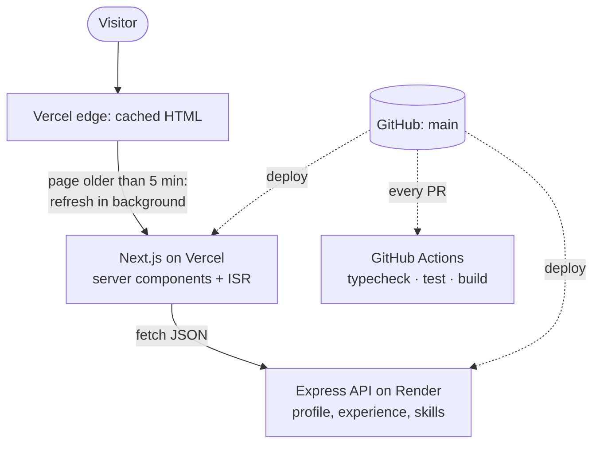
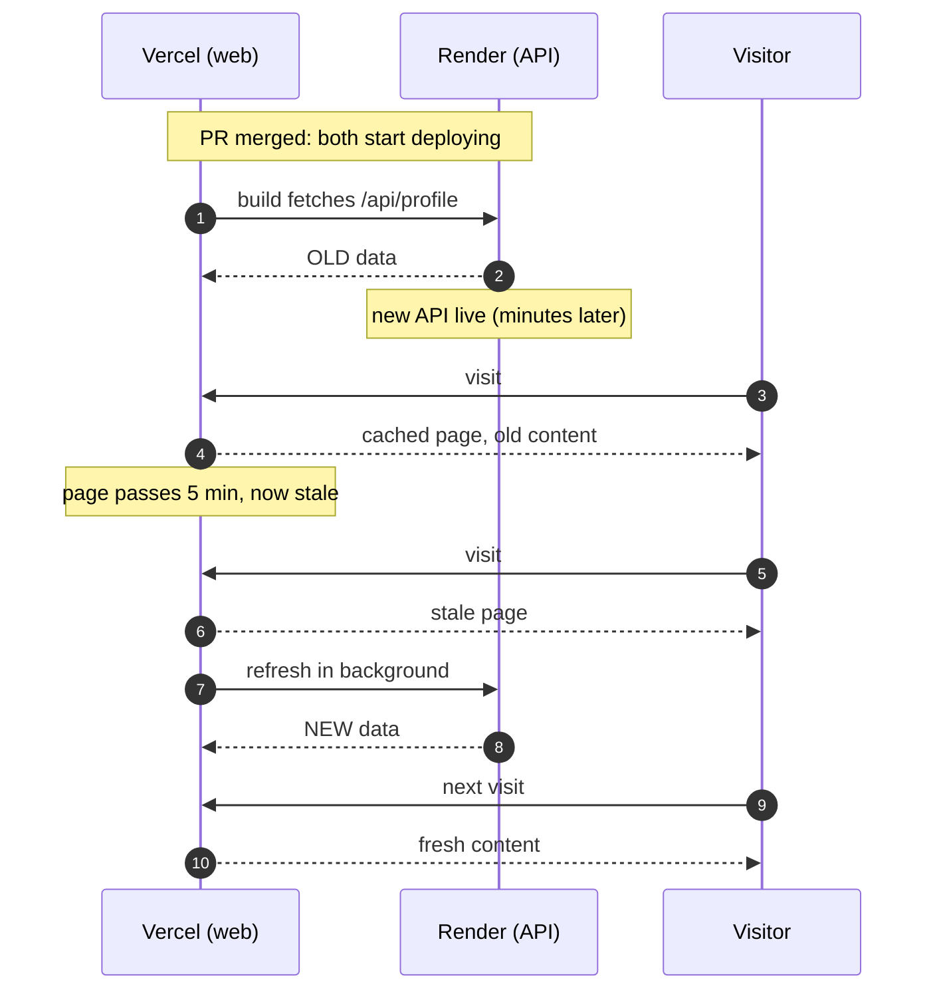

For a long time, I'd been flirting with the idea of a portfolio that actually reflects who I am: what I do, my professional journey, and the skills I've picked up along the way. For better or worse (mostly worse), I never got around to it. Then inspiration struck out of the blue (a late-night coffee helps), and I finally set up the repo, with an AI pair-programmer doing a lot of the heavy lifting.

I build large, high-traffic systems at work, so I assumed a personal portfolio would be the easy part. It wasn't. A two-app site with one page still found six different ways to break in production, and every one of them is a smaller version of a problem that shows up in much bigger systems.

This is a write-up of those bugs: what users saw, what was actually going on, and what fixed it.

## The setup

The site is a small monorepo with two apps:

- **Web**: Next.js (App Router, React 19, Tailwind CSS v4), deployed on Vercel.
- **API**: Node.js + Express, deployed on Render's free tier. It serves the content (profile, experience, skills) as JSON.

The homepage uses **incremental static regeneration (ISR)**: Vercel serves a cached copy instantly and refreshes it from the API in the background at most every five minutes. That matters because a free Render service sleeps after about 15 minutes idle and takes 30–60 seconds to wake up. With ISR, no visitor ever waits for that.



Simple enough. Here's what went wrong.

## 1. A blank page on phones

**Symptom:** on my laptop the site was fine. On my phone I got a dark background, a loading bar that never finished, and nothing else.

**Cause:** every section faded in on scroll, and I'd implemented that by starting each section at `opacity: 0` and letting JavaScript reveal it with an `IntersectionObserver`. If the JavaScript doesn't run (an older mobile browser, a script that fails to load on a weak connection), nothing ever becomes visible. The whole page depended on an animation.

**Fix:** make content visible by default and only hide it once JavaScript has proven it's running:

```css
/* Visible by default. The Reveal component sets data-reveal on <html>
   when it mounts; only then are off-screen sections hidden. */
[data-reveal] .reveal:not([data-visible]) {
  opacity: 0;
  transform: translateY(16px);
}
```

The component also marks anything already on screen as visible *before* setting that flag, so the hero never blinks out. To test it, I rendered the server HTML in a sandboxed iframe with scripts disabled: 27 of 27 sections visible, down from 0.

**Lesson:** progressive enhancement isn't old-fashioned. Anything that hides content should fail open.

## 2. Content vanishing while scrolling

**Symptom:** after fix #1, the page loaded on phones, but scrolling showed black gaps. Even the hero, which had already rendered, went blank when I scrolled back up, then reappeared seconds later.

**Cause:** the phone's GPU couldn't keep up. The hero had three large glowing blobs animated forever with `filter: blur(160px)`, and the sticky nav used `backdrop-filter: blur()`, which has to be recomputed on every scroll frame. Desktop GPUs shrug that off. Many phones fall behind and show unpainted tiles.

**Fix:** draw the glows as radial gradients instead of blurring solid shapes. They look almost identical and cost almost nothing:

```css
.glow {
  border-radius: 9999px;
  background: radial-gradient(closest-side, var(--glow), transparent);
}
```

Backdrop blur and the looping animations now only apply from tablet width up (`md:backdrop-blur-xl`, `md:animate-drift`). At phone width the page went from 5 blur filters to 0.

With the fix deployed, everything finally renders as it should. Scrolling is smooth as butter on my iPhone 17 Pro, with no more blank tiles, and the glows and cards still look sharp. Most importantly, the flicker is gone, which was a relief.

**Lesson:** blur is one of the most expensive things you can ask a browser to paint. Budget for it like you'd budget for network requests.

## 3. Stale content after every deploy

**Symptom:** I merged a content change, both Vercel and Render showed "deployed", and the live site still showed the old content for several minutes.

**Cause:** a race between two deploys. Vercel builds the Next.js app in about a minute; Render's API deploy takes longer. During its build, Next.js prerenders the homepage and fetches the API, which is still the *old* version. ISR then keeps serving that page until it's five minutes old, and the refresh only happens on the next visit.



I watched it happen by polling the live site every 30 seconds: the new content appeared about six minutes after the API deploy finished, exactly when the cache passed five minutes and a visit triggered the refresh.

The same race can be worse than stale. When a pull request adds a *new* endpoint, the web build can call it before the API has it, get a 404, and fail the whole deploy. The fix there is to treat "not deployed yet" as "no data":

```ts
// Newer endpoints may not exist yet while Render is still deploying.
async function getIfAvailable<T>(path: string): Promise<T | null> {
  const res = await fetch(`${API_URL}${path}`, { next: { revalidate: 300 } });
  if (res.status === 404) return null;
  if (!res.ok) throw new Error(`API request ${path} failed with ${res.status}`);
  return (await res.json()) as T;
}
```

The page skips the section until the data exists, and it appears on the next refresh. I tested that by building the new web app against the live, older API. The build passed and every other section rendered.

**Lesson:** two independently deployed services are a distributed system, even when it's just your portfolio. The web app has to handle the API being one version behind or ahead. The cleaner long-term fix is on-demand revalidation: the API tells the web app to refresh the moment it goes live.

## 4. A number that didn't fit its card

**Symptom:** on phones, one highlight card read `50% → 30%` and the text ran past the card's right edge.

**Cause:** the numbers were a fixed 30–36px with `white-space: nowrap`. Measuring every card at 375px width showed a second offender I hadn't noticed: `$20–25M` was 135px wide in a card with 110px of room.

**Fix:** size the number to its card, not the screen, with a container query:

```tsx
<div className="@container ...">
  <dd className="text-[clamp(1.125rem,20cqi,2.25rem)] whitespace-nowrap ...">
```

`20cqi` is 20% of the card's width, clamped between 18px and 36px. Desktop keeps the full 36px; narrow cards scale down. I checked all values at 320, 360, 412, 768 and 1440px.

**Lesson:** when one thing overflows, measure everything like it. The bug report you get is rarely the only instance.

## 5. Tailwind classes that silently did nothing

**Symptom:** the nav's "Get in touch" button was meant to be a small pill. It had been rendering as a full-size button since the redesign, and nobody noticed.

**Cause:** the button helper added default sizes (`px-5 py-3 rounded-xl`), and the nav passed overrides (`px-4 py-2 rounded-full`) as extra classes. When two conflicting Tailwind utilities are on the same element, the winner is decided by their order in the *generated stylesheet*, not the order in `className`. The defaults won, every time.

**Fix:** make size an explicit option instead of an override:

```ts
const buttonSizes = {
  md: "rounded-xl px-5 py-3 text-[15px]",
  compact: "rounded-xl px-3.5 py-3 text-[15px]",
  pill: "rounded-full px-4 py-2 text-sm",
};
```

**Lesson:** "append a class to override" is a trap with utility CSS. Either design components with explicit variants, or use a merge helper like `tailwind-merge`.

## 6. CI failing on an image import

**Symptom:** adding a photo broke CI with `TS2307: Cannot find module '@/assets/photo.jpg'`. It passed on my machine.

**Cause:** TypeScript learns what an imported `.jpg` is from `next-env.d.ts`, a file Next.js generates when you run `next dev` or `next build`, and which is (correctly) git-ignored. My machine had one; CI runs the typecheck *before* building, so it didn't.

**Fix:** generate the types first. Next.js has a command for exactly this:

```json
"typecheck": "next typegen && tsc --noEmit"
```

I reproduced CI locally by deleting `next-env.d.ts` and `.next` first: 2 errors before the change, 0 after.

**Lesson:** "works on my machine" usually means "depends on a file my machine generated". Reproduce CI from a clean checkout.

## What I'd tell myself at the start

- **Fail open.** Hidden-by-default content, required new endpoints and optimistic assumptions about the network are all the same bug.
- **Paint is a budget.** Measure filters and animations on a real phone, not just in desktop devtools.
- **Deploys are a distributed system.** Any two services that ship separately will, at some point, be running mismatched versions.
- **Measure, then fix.** Most of these took minutes to fix and much longer to understand. Every fix above came with a check that proved it: a count, a width, a clean build.

I have a few more project ideas in the pipeline, so expect more articles on what I learn building them. And if you've hit any of these bugs yourself, I'd love to hear how you fixed them.

The site's source is on [GitHub](https://github.com/anshul0410/anshul-portfolio) if you want to see any of these fixes in context.
